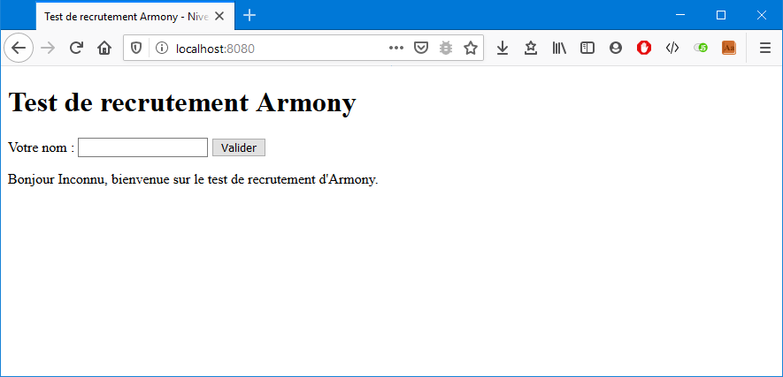
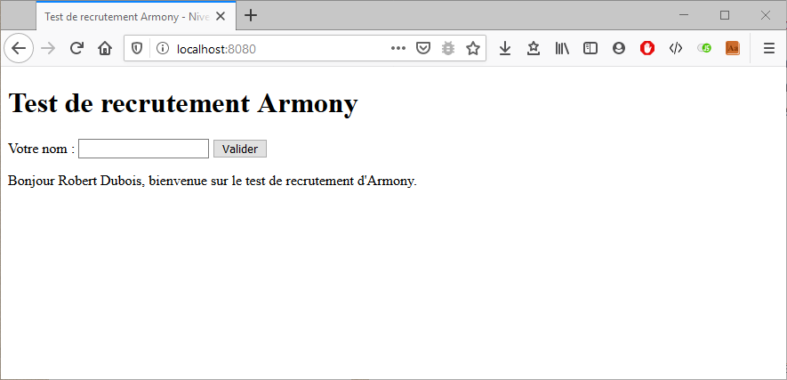
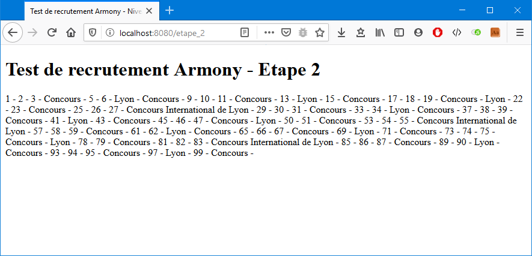
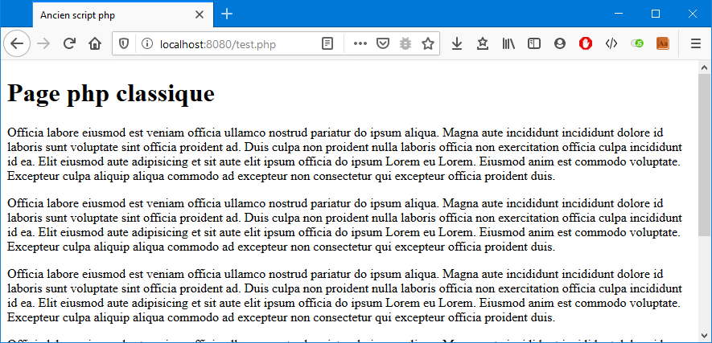

# Test de recrutement Armonia - Niveau 1

Ce test a été mis au point pour tenter de cerner vos capacités. Ce ne sont pas vos connaissances qui nous importent le plus mais plutôt votre capacité d'adaptation et votre capacité à identifier un problème et à en trouver les solutions.

Vous devez faire ce test seul, sans aide externe mais vous pouvez bien entendu vous documenter sur internet.

Pour chaque étape du test, vous devrez publier votre solution via git, sur notre dépôt. Le dépôt contient déjà une branche solution. Vous devez publier sur cette branche et non pas sur la branche master. Si vous n'y arrivez pas, vous nous enverrez par mail votre projet fini sous forme d'archive.

## Installation

* Cloner le projet git
* Installer les dépendances du projet avec [Composer](https://getcomposer.org/)
* Lancer le serveur de test intégré à php : `php -S localhost:8000 public/index.php`
* Ouvrir la page index du projet : [http://localhost:8000/](http://localhost:8000/)

## 1ère étape

Sur la page d'index du projet, insérer un formulaire contenant un champ de type texte.
* Lorsque le formulaire est soumis avec la valeur "Robert Dubois", la page doit afficher :  `Bonjour Robert Dubois, bienvenue sur le test de recrutement d'Armony.`
* Lorsque le formulaire est soumis sans valeur, la page doit afficher :  `Bonjour Inconnu, bienvenue sur le test de recrutement d'Armony.`

## 2ème étape

* Créer une page qui a pour adresse : [http://localhost:8000/etape_2](http://localhost:8000/etape_2)
* Sur cette page, afficher la liste des nombres de 1 à 100.
* Remplacer certains nombres selon les instructions suivantes :
  * Si le nombre est divisible par **4**, afficher "**Concours**"
  * Si le nombre est divisible par **7**, afficher "**Lyon**"
  * Si le nombre est divisible par **4** et **7**, afficher "**Concours International de Lyon**"

## 3ème étape

La page [http://localhost:8000/test.php](http://localhost:8000/test.php) ne s'affiche pas correctement. Corriger les erreurs et vérifier son bon fonctionnement.

## Captures d'écran des résultats attendus

### Etape 1

### Etape 2

### Etape 3

